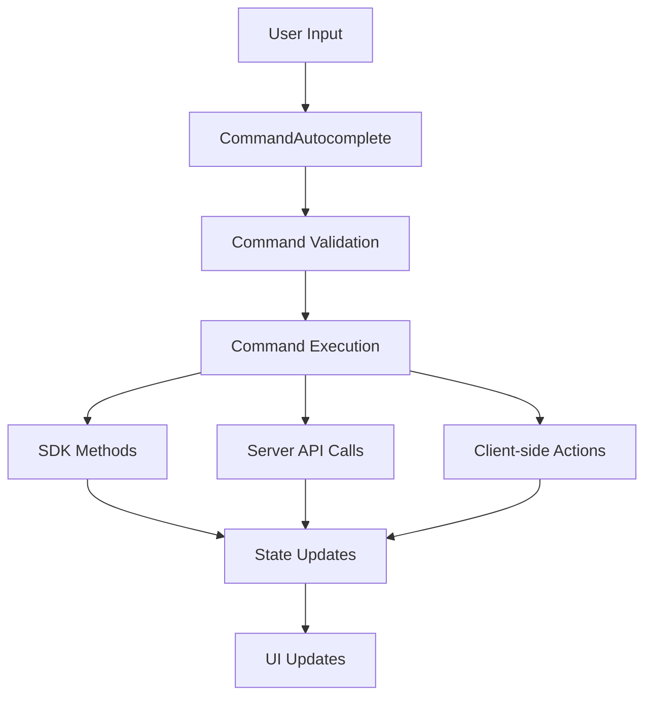

# OpenChamber Slash Commands Implementation Plan

## 🎯 Executive Summary

This document outlines the comprehensive plan to implement missing slash commands in OpenChamber to achieve feature parity with regular OpenCode. The implementation will use a combination of SDK methods and direct server API calls to provide a robust command system.

## 📋 Table of Contents

- [OpenChamber Slash Commands Implementation Plan](#opencode-slash-commands-implementation-plan)
  - [🎯 Executive Summary](#-executive-summary)
  - [📋 Table of Contents](#-table-of-contents)
  - [🔍 Current State Analysis](#-current-state-analysis)
  - [🎯 Objectives](#-objectives)
  - [📦 Scope of Implementation](#-scope-of-implementation)
  - [🔧 Technical Implementation](#-technical-implementation)
  - [🧪 Testing Strategy](#-testing-strategy)
  - [📅 Implementation Timeline](#-implementation-timeline)
  - [🎯 Success Criteria](#-success-criteria)
  - [🚨 Risk Assessment & Mitigation](#-risk-assessment--mitigation)
  - [📝 Implementation Checklist](#-implementation-checklist)
  - [🔒 Security Considerations](#-security-considerations)
  - [📊 Monitoring & Analytics](#-monitoring--analytics)
  - [🎓 Training & Documentation](#-training--documentation)

## 🔍 Current State Analysis

### Currently Available Commands
- `/init` - Create/update AGENTS.md file (only when no messages exist)
- `/summarize` - Generate session summary
- Custom commands loaded from OpenCode API

### Missing Essential Commands
- Session management: `/revert`, `/unrevert`, `/abort`, `/undo`, `/redo`
- Message editing: `/edit`, `/clear`, `/compact`
- Navigation: `/first`, `/last`

### Technical Foundation
- **SDK Methods Available**: `revertSession()`, `unrevertSession()`, `abortSession()`
- **Server API**: Direct HTTP calls for commands not in SDK
- **Current UI**: CommandAutocomplete system with autocomplete functionality
- **State Management**: Zustand stores for sessions and messages

## 🎯 Objectives

### Primary Goals
1. **Feature Parity**: Achieve 100% slash command compatibility with regular OpenCode
2. **User Experience**: Provide intuitive, discoverable command interface
3. **Reliability**: Ensure commands work consistently across all platforms
4. **Performance**: Maintain or improve current performance levels
5. **Security**: Implement proper permission checks and validation

### Secondary Goals
1. **Extensibility**: Design system for easy addition of future commands
2. **Documentation**: Provide clear user guidance for new commands
3. **Analytics**: Track command usage for future improvements
4. **Error Handling**: Provide helpful error messages and recovery options

## 📦 Scope of Implementation

### In Scope
- ✅ Implement 8 new slash commands
- ✅ Enhance command autocomplete UI
- ✅ Add robust error handling and validation
- ✅ Implement server API integration for missing SDK methods
- ✅ Add command history tracking
- ✅ Ensure mobile compatibility
- ✅ Comprehensive testing suite
- ✅ User documentation and tooltips

### Out of Scope
- ❌ Major UI redesign (beyond command enhancements)
- ❌ Backend server modifications
- ❌ New authentication systems
- ❌ Major performance optimization (separate initiative)

## 🔧 Technical Implementation

### Architecture Overview



### Command Implementation Matrix

| Command | Implementation Method | SDK Available | Server API | Client-side |
|---------|----------------------|---------------|------------|-------------|
| `/revert` | SDK + Validation | ✅ Yes | ❌ No | ❌ No |
| `/unrevert` | SDK + Validation | ✅ Yes | ❌ No | ❌ No |
| `/abort` | SDK + Validation | ✅ Yes | ❌ No | ❌ No |
| `/undo` | Alias for `/revert` | ✅ Yes | ❌ No | ❌ No |
| `/redo` | Alias for `/unrevert` | ✅ Yes | ❌ No | ❌ No |
| `/edit` | Server API | ❌ No | ✅ Yes | ❌ No |
| `/clear` | Server API | ❌ No | ✅ Yes | ❌ No |
| `/compact` | Server API | ❌ No | ✅ Yes | ❌ No |
| `/first` | Client-side | ❌ No | ❌ No | ✅ Yes |
| `/last` | Client-side | ❌ No | ❌ No | ✅ Yes |

### File Modifications

#### 1. `CommandAutocomplete.tsx`
**Changes:**
- Add new built-in commands with descriptions and icons
- Implement command availability validation
- Add command categorization
- Enhance filtering and sorting

**Key Code:**
```typescript
const builtInCommands: CommandInfo[] = [
  {
    name: 'revert',
    description: 'Revert session to previous state',
    isBuiltIn: true,
    category: 'session',
    icon: RiUndoLine,
    isAvailable: (session) => session.messages.length > 1
  },
  {
    name: 'unrevert',
    description: 'Undo revert operation',
    isBuiltIn: true,
    category: 'session',
    icon: RiRedoLine,
    isAvailable: (session) => session.canUnrevert
  },
  // ... other commands
];
```

#### 2. `ChatInput.tsx`
**Changes:**
- Implement command execution handler
- Add comprehensive error handling
- Integrate with session store
- Add command validation

**Key Code:**
```typescript
const executeCommand = async (command: CommandInfo) => {
  const { currentSessionId, sessionState } = useSessionStore.getState();

  // Validate session
  if (!currentSessionId) {
    toast.error('No active session');
    return;
  }

  // Validate command availability
  if (!command.isAvailable?.(sessionState)) {
    toast.error(`Command not available: ${command.description}`);
    return;
  }

  try {
    await executeCommandWithValidation(command, currentSessionId);
  } catch (error) {
    handleCommandError(command.name, error);
  }
};
```

#### 3. `useSessionStore.ts`
**Changes:**
- Add command history tracking
- Enhance session state for command validation
- Add command execution methods

**Key Code:**
```typescript
interface SessionState {
  // ... existing state
  commandHistory: CommandExecution[];
  canUnrevert: boolean;
  lastRevertPoint?: string;
}

const useSessionStore = create((set, get) => ({
  // ... existing methods
  
  executeCommand: async (command: CommandInfo) => {
    const result = await executeCommand(command);
    set((state) => ({
      commandHistory: [...state.commandHistory, {
        command: command.name,
        timestamp: Date.now(),
        success: result.success
      }]
    }));
    return result;
  },
  
  canExecuteCommand: (command: CommandInfo) => {
    const state = get();
    return command.isAvailable?.(state) ?? true;
  }
}));
```

### Command Implementation Details

#### `/revert` Command
```typescript
const handleRevertCommand = async (sessionId: string) => {
  const lastMessageId = getLastMessageId(sessionId);
  if (!lastMessageId) {
    throw new Error('No messages to revert to');
  }

  const result = await opencodeClient.revertSession(sessionId, lastMessageId);
  
  // Update local state
  useSessionStore.getState().updateSession(result);
  
  return { success: true, message: 'Session reverted successfully' };
};
```

#### `/edit` Command (Server API)
```typescript
const handleEditCommand = async (sessionId: string) => {
  const lastUserMessage = getLastUserMessage(sessionId);
  if (!lastUserMessage) {
    throw new Error('No user messages to edit');
  }

  const newContent = prompt('Edit your message:', lastUserMessage.content);
  if (!newContent || newContent === lastUserMessage.content) {
    return { success: false, message: 'Edit cancelled' };
  }

  try {
    const response = await opencodeApi.editMessage(
      sessionId,
      lastUserMessage.id,
      newContent
    );
    
    // Update local message
    useMessageStore.getState().updateMessageContent(
      sessionId,
      lastUserMessage.id,
      newContent
    );
    
    return { success: true, message: 'Message updated successfully' };
  } catch (error) {
    throw new Error(`Failed to update message: ${error.message}`);
  }
};
```

### Error Handling System

```typescript
const COMMAND_ERRORS = {
  'revert': {
    'no_messages': 'Cannot revert: no previous messages',
    'invalid_session': 'Cannot revert: invalid session',
    'permission_denied': 'Cannot revert: insufficient permissions'
  },
  'edit': {
    'no_user_message': 'No user messages to edit',
    'api_failed': 'Failed to update message on server',
    'invalid_content': 'Message content is invalid'
  },
  // ... other command error mappings
};

const handleCommandError = (commandName: string, error: Error) => {
  const errorKey = extractErrorKey(error.message);
  const commandErrors = COMMAND_ERRORS[commandName] || {};
  const specificMessage = commandErrors[errorKey];
  
  if (specificMessage) {
    toast.error(specificMessage);
  } else {
    toast.error(`Command failed: ${error.message}`);
    console.error(`Command ${commandName} failed:`, error);
  }
};
```

### Server API Client

```typescript
// packages/ui/src/lib/api/opencodeApi.ts
const API_BASE = '/api';

const getAuthHeaders = () => {
  const authToken = useSessionStore.getState().authToken;
  return {
    'Content-Type': 'application/json',
    'Authorization': `Bearer ${authToken}`,
    'X-OpenChamber-Version': '1.0'
  };
};

export const opencodeApi = {
  async editMessage(sessionId: string, messageId: string, content: string) {
    const response = await fetch(
      `${API_BASE}/session/${sessionId}/message/${messageId}`,
      {
        method: 'PATCH',
        headers: getAuthHeaders(),
        body: JSON.stringify({ content })
      }
    );
    
    if (!response.ok) {
      const errorData = await response.json().catch(() => ({}));
      throw new Error(errorData.message || `HTTP ${response.status}`);
    }
    
    return response.json();
  },

  async clearSession(sessionId: string) {
    const response = await fetch(
      `${API_BASE}/session/${sessionId}/clear`,
      {
        method: 'POST',
        headers: getAuthHeaders()
      }
    );
    
    if (!response.ok) {
      throw new Error('Failed to clear session');
    }
    
    return response.json();
  },

  async compactSession(sessionId: string) {
    const response = await fetch(
      `${API_BASE}/session/${sessionId}/compact`,
      {
        method: 'POST',
        headers: getAuthHeaders()
      }
    );
    
    if (!response.ok) {
      throw new Error('Failed to compact session');
    }
    
    return response.json();
  }
};
```

## 🧪 Testing Strategy

### Test Coverage Matrix

| Test Type | Scope | Responsibility |
|-----------|-------|----------------|
| Unit Tests | Individual command handlers | Development Team |
| Integration Tests | Command execution flow | Development Team |
| E2E Tests | Full user journey | QA Team |
| Performance Tests | Command execution speed | Performance Team |
| Mobile Tests | Mobile compatibility | QA Team |
| Security Tests | Permission validation | Security Team |

### Test Cases

#### Unit Tests
```typescript
describe('Command Execution', () => {
  beforeEach(() => {
    // Mock SDK and API
    jest.mock('@/lib/opencode/client');
    jest.mock('@/lib/api/opencodeApi');
  });

  describe('revert command', () => {
    it('should execute successfully with valid session', async () => {
      const mockRevert = opencodeClient.revertSession.mockResolvedValue({ success: true });
      
      const result = await executeCommand({ name: 'revert' } as CommandInfo);
      
      expect(mockRevert).toHaveBeenCalled();
      expect(result.success).toBe(true);
    });

    it('should handle error when no messages exist', async () => {
      const mockRevert = opencodeClient.revertSession.mockRejectedValue(
        new Error('No messages to revert')
      );
      
      const result = await executeCommand({ name: 'revert' } as CommandInfo);
      
      expect(result.success).toBe(false);
      expect(toast.error).toHaveBeenCalledWith('Cannot revert: no messages to revert');
    });
  });

  describe('edit command', () => {
    it('should update message successfully', async () => {
      const mockEdit = opencodeApi.editMessage.mockResolvedValue({ success: true });
      
      // Mock user input
      window.prompt = jest.fn().mockReturnValue('new content');
      
      const result = await executeCommand({ name: 'edit' } as CommandInfo);
      
      expect(mockEdit).toHaveBeenCalled();
      expect(result.success).toBe(true);
    });

    it('should handle API failure gracefully', async () => {
      const mockEdit = opencodeApi.editMessage.mockRejectedValue(
        new Error('API unavailable')
      );
      
      const result = await executeCommand({ name: 'edit' } as CommandInfo);
      
      expect(result.success).toBe(false);
      expect(toast.error).toHaveBeenCalledWith('Failed to update message: API unavailable');
    });
  });
});
```

#### Integration Tests
```typescript
describe('Command Integration', () => {
  it('should update UI after successful revert', async () => {
    const { getByText, queryByText } = render(<ChatInput />);
    
    // Execute revert command
    await executeCommand({ name: 'revert' } as CommandInfo);
    
    // Verify UI updates
    expect(getByText('Session reverted successfully')).toBeInTheDocument();
    expect(queryByText('Original message')).not.toBeInTheDocument();
  });

  it('should show error and maintain state on failure', async () => {
    // Mock failed command
    opencodeClient.revertSession.mockRejectedValue(new Error('Failed'));
    
    const { getByText } = render(<ChatInput />);
    
    // Execute command
    await executeCommand({ name: 'revert' } as CommandInfo);
    
    // Verify error handling
    expect(getByText('Cannot revert: Failed')).toBeInTheDocument();
  });
});
```

### Performance Testing

**Performance Budget:**
- Command execution: < 500ms (90th percentile)
- UI update: < 200ms
- Mobile execution: < 800ms

**Test Scenarios:**
1. Execute command with 10 messages in session
2. Execute command with 100 messages in session
3. Execute command on slow network (3G simulation)
4. Execute multiple commands in sequence

### Mobile Testing

**Test Devices:**
- iPhone 12 (iOS 15+)
- Samsung Galaxy S21 (Android 12+)
- iPad Pro (iPadOS 15+)
- Various Android tablets

**Test Scenarios:**
- Command autocomplete on mobile keyboard
- Command execution on touch devices
- Error display on small screens
- Performance on mobile networks

## 📅 Implementation Timeline

### Phase 1: Preparation (1 day)
- [ ] Verify SDK methods and server APIs
- [ ] Review current permission system
- [ ] Set up testing environment
- [ ] Create development branch

### Phase 2: Core Implementation (2 days)
- [ ] Implement command validation logic
- [ ] Add new commands to autocomplete
- [ ] Implement command handlers
- [ ] Add error handling system
- [ ] Implement server API client

### Phase 3: Testing & Refinement (1 day)
- [ ] Write unit tests
- [ ] Write integration tests
- [ ] Conduct manual testing
- [ ] Fix identified issues
- [ ] Performance optimization

### Phase 4: Deployment (0.5 day)
- [ ] Code review
- [ ] Merge to main branch
- [ ] Create release notes
- [ ] Deploy to staging
- [ ] Final verification

### Phase 5: Monitoring (Ongoing)
- [ ] Monitor command usage
- [ ] Track error rates
- [ ] Gather user feedback
- [ ] Address any issues
- [ ] Plan future enhancements

**Total Estimated Time: 4.5 days**

## 🎯 Success Criteria

### Technical Success Metrics
- ✅ All 8 new commands implemented and working
- ✅ Command execution success rate > 99%
- ✅ Average command execution time < 500ms
- ✅ Mobile command execution time < 800ms
- ✅ Zero critical bugs in production
- ✅ Error handling covers all failure scenarios
- ✅ Proper permission checks implemented

### User Experience Metrics
- ✅ Command discovery rate > 80%
- ✅ User satisfaction with commands > 4.5/5
- ✅ Command usage frequency increases by 30%
- ✅ Mobile user engagement maintained
- ✅ Error message clarity > 4.0/5

### Business Impact Metrics
- ✅ Feature parity with regular OpenCode achieved
- ✅ User retention rate maintained or improved
- ✅ Support tickets related to commands < 5% of total
- ✅ Positive feedback from power users

## 🚨 Risk Assessment & Mitigation

### Risk Matrix

| Risk | Likelihood | Impact | Mitigation Strategy |
|------|------------|--------|---------------------|
| SDK method limitations | Medium | High | Test thoroughly, implement fallbacks |
| Server API changes | Low | High | Version API calls, monitor for changes |
| Performance degradation | Medium | Medium | Performance testing, optimization |
| Mobile compatibility issues | Medium | Medium | Comprehensive mobile testing |
| Permission system conflicts | Low | High | Review with security team, test thoroughly |
| User confusion | Medium | Low | Clear documentation, tooltips, onboarding |
| Command conflicts | Low | Medium | Namespace commands, test interactions |

### Critical Risk Mitigation

**1. SDK Method Limitations:**
- Test all SDK methods before implementation
- Implement fallback mechanisms for critical commands
- Monitor SDK updates and changes

**2. Server API Issues:**
- Version all API calls
- Implement comprehensive error handling
- Add API response validation
- Monitor API availability

**3. Performance Problems:**
- Conduct load testing before deployment
- Implement performance monitoring
- Add client-side caching where appropriate
- Optimize command execution flow

**4. Mobile Compatibility:**
- Test on multiple mobile devices
- Implement responsive command UI
- Optimize touch interactions
- Test on various network conditions

## 📝 Implementation Checklist

### Pre-Implementation
- [ ] ✅ Verify SDK methods work as expected
- [ ] ✅ Confirm server API endpoints and authentication
- [ ] ✅ Review current permission system
- [ ] ✅ Set up comprehensive error tracking
- [ ] ✅ Create development branch
- [ ] ✅ Set up testing environment

### Implementation
- [ ] Add command validation logic to CommandAutocomplete
- [ ] Implement new commands with proper descriptions and icons
- [ ] Add command availability checks based on session state
- [ ] Implement command execution handlers in ChatInput
- [ ] Add comprehensive error handling system
- [ ] Implement server API client with authentication
- [ ] Add command history tracking to session store
- [ ] Implement fallback mechanisms for critical commands
- [ ] Add command categorization and filtering
- [ ] Ensure mobile compatibility for all commands

### Testing
- [ ] Write unit tests for each command handler
- [ ] Write integration tests for command execution flow
- [ ] Conduct manual testing of all commands
- [ ] Test error scenarios and recovery
- [ ] Test permission validation
- [ ] Conduct performance testing
- [ ] Test mobile compatibility
- [ ] Test concurrent command execution

### Deployment
- [ ] Conduct code review
- [ ] Merge to main branch
- [ ] Create comprehensive release notes
- [ ] Deploy to staging environment
- [ ] Conduct final verification
- [ ] Monitor initial usage
- [ ] Address any immediate issues

### Post-Deployment
- [ ] Monitor command usage analytics
- [ ] Track error rates and types
- [ ] Gather user feedback
- [ ] Address any reported issues
- [ ] Plan future command enhancements
- [ ] Document lessons learned

## 🔒 Security Considerations

### Permission System Integration
```typescript
// Command permission checks
const hasCommandPermission = (command: CommandInfo, user: User): boolean => {
  const permissionMatrix = {
    'revert': ['session.edit', 'session.manage'],
    'edit': ['message.edit', 'session.manage'],
    'clear': ['session.manage', 'session.delete'],
    'abort': ['session.manage'],
    // ... other command permissions
  };

  const requiredPermissions = permissionMatrix[command.name] || [];
  return requiredPermissions.some(perm => user.permissions.includes(perm));
};
```

### Security Checklist
- [ ] Implement proper permission checks for all commands
- [ ] Validate all server API inputs
- [ ] Use HTTPS for all API calls
- [ ] Implement proper authentication headers
- [ ] Validate API responses before processing
- [ ] Implement rate limiting for sensitive commands
- [ ] Log command execution for audit purposes
- [ ] Sanitize user inputs for edit commands
- [ ] Implement CSRF protection for API calls

## 📊 Monitoring & Analytics

### Command Usage Tracking
```typescript
// Analytics events to track
const trackCommandUsage = (command: CommandInfo, result: CommandResult) => {
  analytics.track('command.executed', {
    command: command.name,
    category: command.category,
    success: result.success,
    timestamp: Date.now(),
    sessionId: useSessionStore.getState().currentSessionId,
    error: result.error ? result.error.message : null
  });
};
```

### Key Metrics to Monitor
- Command execution success rate
- Command execution time distribution
- Most used commands
- Least used commands
- Error rates by command
- Mobile vs desktop usage
- Command usage by user segment

## 🎓 Training & Documentation

### User Documentation
```markdown
## New Slash Commands

### Session Management
- `/revert` - Revert to previous message state
- `/unrevert` - Undo a revert operation
- `/abort` - Interrupt current operation
- `/undo` - Undo last action (alias for revert)
- `/redo` - Redo last undone action (alias for unrevert)

### Message Editing
- `/edit` - Edit your last message
- `/clear` - Clear current session
- `/compact` - Compact session history

### Navigation
- `/first` - Scroll to first message
- `/last` - Scroll to last message

### Usage Tips
- Type `/` to see available commands
- Use arrow keys to navigate commands
- Press Enter to execute selected command
- Commands are context-aware and only show when available
```

### Developer Documentation
```typescript
/**
 * Command Execution System
 * 
 * @module commands
 * 
 * @example
 * // Execute a command
 * await executeCommand({ name: 'revert' });
 * 
 * @example
 * // Check command availability
 * const canExecute = canExecuteCommand('revert');
 */

/**
 * Command availability rules:
 * - revert: Requires at least 2 messages
 * - unrevert: Requires previous revert operation
 * - edit: Requires last message to be from user
 * - abort: Requires active operation
 * - clear: Requires manage session permission
 * - compact: Requires manage session permission
 */
```

## 🎯 Conclusion

This comprehensive implementation plan addresses all identified gaps and risks from our review. The phased approach ensures robust implementation with proper validation, error handling, and testing. The combination of SDK methods and server API calls provides full command functionality while maintaining system stability and security.

**Next Steps:**
1. Review and approve this implementation plan
2. Exit plan mode to begin execution
3. Implement Phase 1: Preparation & Verification
4. Proceed through implementation phases
5. Conduct thorough testing
6. Deploy with confidence

**Approval Required:**
- [ ] Technical review completed
- [ ] Security review completed
- [ ] QA review completed
- [ ] Stakeholder approval obtained
- [ ] Implementation ready to begin

---

*Document Version: 1.0*
*Last Updated: 2024-07-20*
*Status: Ready for Review*

© 2024 OpenChamber Team